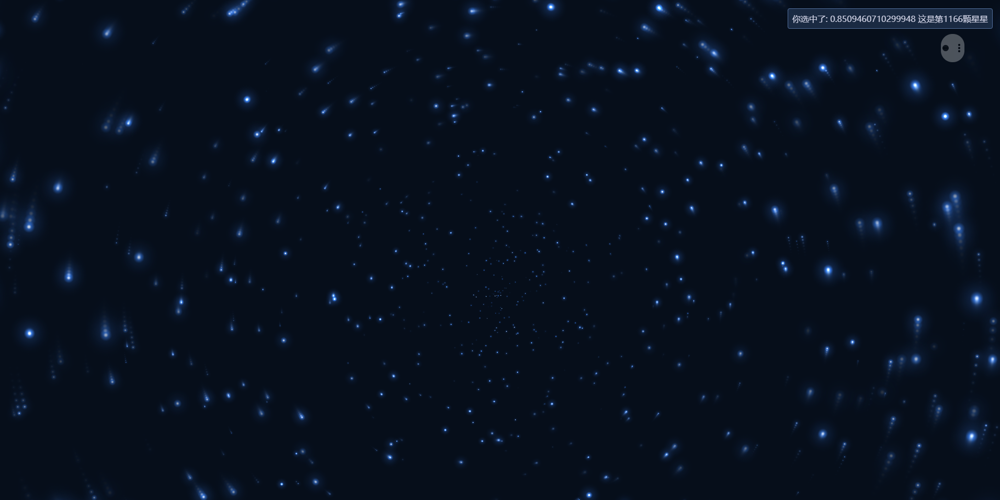

# practise_canvas_drawStars

[参考栗子-画星星](http://www.jq22.com/jquery-info13901)
[参考栗子-缩放拖拽](https://codepen.io/techslides/pen/zowLd?editors=0010)
[参考栗子-鼠标移动](http://www.htmleaf.com/html5/html5-canvas/201505041778.html)

#具体讲解
TODO: 有缘完善
## scale 缩放
## translate 平移
## drawimage
## clearRect 结合缩放的清空
## globalCompositeOperation 合成模式(很像拓扑)